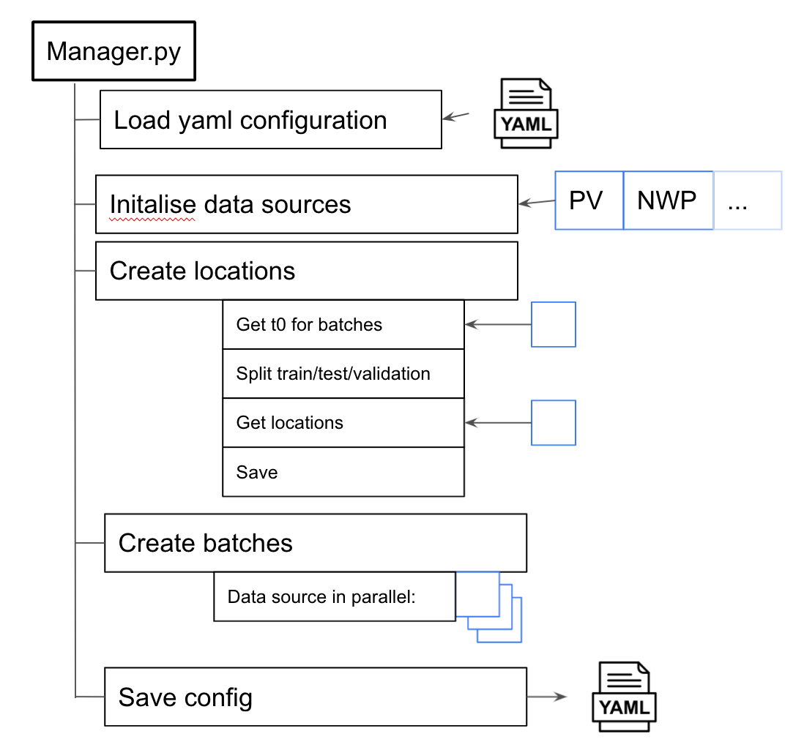

# Nowcasting

This main dir contains the following dirs and files

## Dirs

### config

Defined, load and save configurations. Also stores two example configurations.

#### data_ources

Functions on how to load and manipulate each different data source

### dataset

Functions and methods for a 'batch' which is a collection of examples from the different data sources

### filesystems

Utility functions on how to access local and cloud files

## Files

### consts.py

Constant strings and variables that are needed throughout the repo

### geospatial.py

Geospatial functions that are used to transform coordinates. For example latitude and longitude to OSGB.

### manager.py

Class used to make batches from the different data sources

([here](https://docs.google.com/presentation/d/10P0-EikNrJrGWzCrGEcXoktLTAwp8n7I-fwTT4IfNso/edit#slide=id.p) for raw image)

In general there are a few steps how to use this function
1. `load_yaml_configuration` - loads a configuration file
2. `initialise_data_sources` - Initialise all the data sources. Note that this can be the full set of data sources, or a subset can be passed in
3. `create_files_specifying_spatial_and_temporal_locations_of_each_example_if_necessary` - Method to make the time and locations of the batches that will be made.
   - Get all t0s from the different data sources and find common intersection
   - Split the times into train, validation and test sets
   - Make the locations of the batches. This is done by looking at one dataset, defined by `config.input_data.data_source_which_defines_geospatial_locations`
   - Save these times and locations to a csv.

Note that if this process has run before, and the csv file has been saved, this step does not run
4. `create_batches` - create the batches for each different data source. Each different data source is run in parallel.
5. `dervied_batches` - TODO
6. `save_yaml_configuration` - Save a configuration file to the same location as the batches. The git information is also saved

### square.py

Methods to mask things in bounding boxes ( or squares)
.
### time.py

Time utility functions for time related functions e.g night time filtering

### utils.py

General util functions (TODO #170 probably needs some tidying up)
