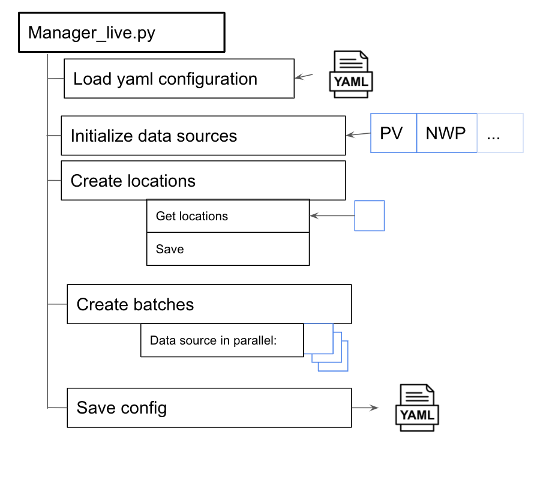

# nowcasting_dataset

This main dir contains the following dirs and files

## Dirs

### base.py

Base class used for `Manager` and `ManagerLive`

This contains
1. `load_yaml_configuration` - loads a configuration file
2. `initialise_data_sources` - Initialise all the data sources. Note that this can be the full set of data sources, or a subset can be passed in
3. `filename_of_locations_csv_file` - get the file name of the locations csv.

### manager.py

Class used to make batches from the different data sources

([here](https://docs.google.com/presentation/d/10P0-EikNrJrGWzCrGEcXoktLTAwp8n7I-fwTT4IfNso/edit#slide=id.p) for raw image)

In general there are a few steps how to use this function
1. `load_yaml_configuration` - loads a configuration file. This is from `base.py`.
2. `initialise_data_sources` - Initialise all the data sources. Note that this can be the full set of data sources, or a subset can be passed in. This is from `base.py`.
3. `create_files_specifying_spatial_and_temporal_locations_of_each_example_if_necessary` - Method to make the time and locations of the batches that will be made.
   - Get all t0s from the different data sources and find common intersection
   - Split the times into train, validation and test sets
   - Make the locations of the batches. This is done by looking at one dataset, defined by `config.input_data.data_source_which_defines_geospatial_locations`
   - Save these times and locations to a csv.

Note that if this process has run before, and the csv file has been saved, this step does not run
4. `create_batches` - create the batches for each different data source. Each different data source is run in parallel.
5`save_yaml_configuration` - Save a configuration file to the same location as the batches. The git information is also saved

### manager_live.py

Class used to make batches from the different data sources for live predictions

([here](https://docs.google.com/presentation/d/10P0-EikNrJrGWzCrGEcXoktLTAwp8n7I-fwTT4IfNso/edit#slide=id.p) for raw image)

In general there are a few steps how to use this function
1. `load_yaml_configuration` - loads a configuration file. This is from `base.py`.
2. `initialise_data_sources` - Initialise all the data sources. Note that this can be the full set of data sources, or a subset can be passed in. This is from `base.py`.
3. `create_files_specifying_spatial_and_temporal_locations_of_each_example_if_necessary` - Method to make the locations of the batches that will be made. A datetime is given as an input.
   - Make the locations of the batches. This is done by looking at one dataset, defined by `config.input_data.data_source_which_defines_geospatial_locations`
   - Save these times and locations to a csv.

Note that if this process has run before, and the csv file has been saved, this step does not run
4`create_batches` - create the batches for each different data source. Each different data source is run in parallel.
5`save_yaml_configuration` - Save a configuration file to the same location as the batches. The git information is also saved
